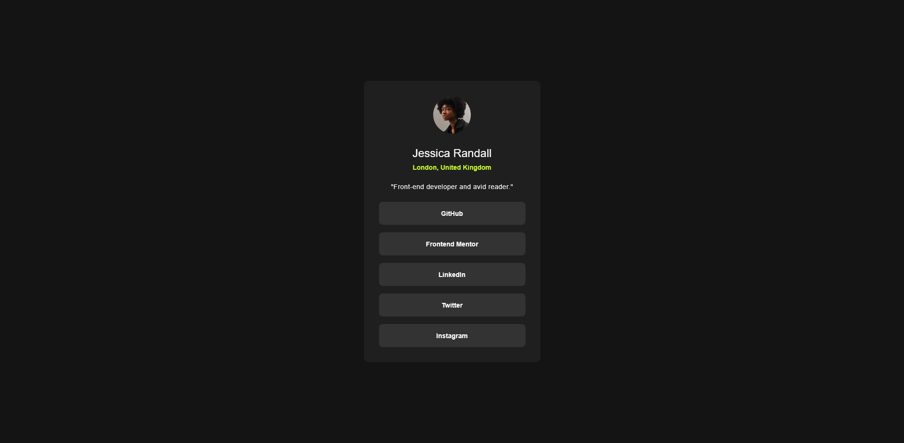

# Frontend Mentor - Social links profile solution

This is a solution to the [Social links profile challenge on Frontend Mentor](https://www.frontendmentor.io/challenges/social-links-profile-UG32l9m6dQ).

## Table of contents

- [Overview](#overview)
  - [The challenge](#the-challenge)
  - [Screenshot](#screenshot)
  - [Links](#links)
- [My process](#my-process)
  - [Built with](#built-with)
  - [What I learned](#what-i-learned)
  - [Continued development](#continued-development)
  - [Useful resources](#useful-resources)
- [Author](#author)
- [Acknowledgments](#acknowledgments)


## Overview

### The challenge

The challenge was to build out a social links profile page based on provided designs and get it looking as close to the design previews as possible.

Users should be able to:

- See hover and focus states for all interactive elements (the social links/buttons) on the page.
- View the optimal layout for the interface depending on their device's screen size.

### Screenshot



### Links

- Solution URL: [Solution social links](https://github.com/vborv/social-links-fmproject/))
- Live Site URL: [Social links project](https://vborv.github.io/social-links-fmproject/)

## My process

### Built with

- Semantic HTML5 markup
- CSS custom properties
- Flexbox
- CSS Grid
- Local Font Loading (`@font-face`)
- Basic Responsive Design principles
- Git & GitHub workflow

### What I learned

This was my first project applying HTML and CSS concepts, and it was a great learning experience. Some key takeaways include:

- **Structuring Content:** How to structure the HTML semantically using tags like `<main>`, ``, `<h1>`, `<p>`, `<ul>`, `<li>`, and `<a>`.
- **CSS Variables:** Using CSS custom properties (`:root`) to manage colors and fonts efficiently, making the code cleaner and easier to maintain.
- **Layout Techniques:** Applying basic Flexbox (`display: flex`, `justify-content`, `align-items`) on the `<body>` to easily center the main content card vertically and horizontally.
- **Styling Interactive Elements:** Implementing `:hover` and `:focus` pseudo-classes to provide visual feedback on interactive elements like buttons, enhancing user experience. I also used `transition` for smoother visual effects.
- **Working with Fonts:** Learning how to use `@font-face` to load custom fonts provided locally within the project assets, including specifying different font weights.
- **File Paths:** Understanding how relative paths work for linking CSS (`<link>`), images (``), and fonts (`url()` within `@font-face`) depending on the file structure.
- **Basic Git Workflow:** Practicing the fundamental Git commands (`git init`, `git add`, `git commit`, `git push`) and connecting a local repository to GitHub. Managing file moves within Git.

```css
/* Example: Centering with Flexbox */
body {
  display: flex;
  justify-content: center;
  align-items: center;
  min-height: 100vh; /* Use min-height for flexibility */
}

/* Example: Using @font-face */
@font-face {
  font-family: 'Inter';
  src: url('../fonts/Inter-Regular.woff2') format('woff2');
  font-weight: 400;
  font-style: normal;
}
```

### Continued development

For future projects, I'd like to focus on:

- Deeper Responsive Design: Using media queries more extensively to fine-tune layouts for different screen sizes beyond the basic mobile/desktop distinction.

- Advanced CSS: Exploring CSS Grid for layout, more complex selectors, and perhaps CSS animations.

- Accessibility: Learning more about ARIA attributes and best practices to ensure websites are usable by everyone.

- JavaScript: Starting to incorporate JavaScript to add more dynamic interactions to web pages.


## Author

- Name - Vanessa BV

- Frontend Mentor - @vborv

- GitHub - [@vborv](https://github.com/vborv/) 

## Acknowledgments

I'd like to thank Frontend Mentor for providing this challenge. It was a great way to start putting my HTML and CSS knowledge into practice.
